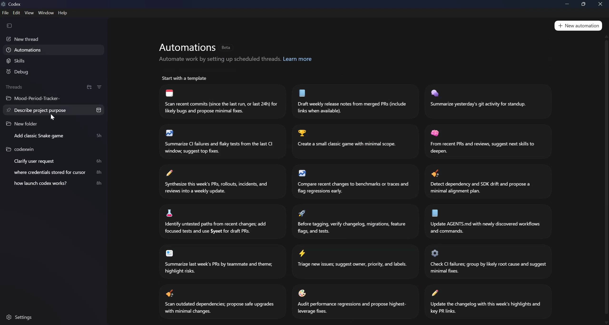

# 🚀 Codex Desktop on Windows (Yes, It Actually Works)

> Turn the macOS Codex app into a native-feeling Windows experience in minutes.



## ⚡ Why This Exists

- No waiting for official Windows release
- One launcher, full setup
- Re-runnable and mostly self-healing

## 🖼 Screenshots

| Startup | Live |
|---|---|
|  |  |

## 🎬 Demo

https://github.com/user-attachments/assets/7fa4ffce-8639-4c80-b791-3b45126ee4a7

## 🔥 Quick Start

```cmd
launch_codex_mac_on_windows.cmd
```

## 🧠 What This Script Does (So You Don’t Have To)

1. Installs missing dependencies
2. Extracts Codex from DMG
3. Patches Electron internals for Windows
4. Rebuilds native modules
5. Launches Codex

## 🛠 If It Breaks, Fix Fast

### Crash on startup

```cmd
del "%TEMP%\codex-electron-win\app\.win-process-patched"
launch_codex_mac_on_windows.cmd
```

### `Codex CLI binary not found`

```cmd
npm install -g @openai/codex
```

### Native module issues

```cmd
del "%TEMP%\codex-electron-win\app\.win-natives-ok"
launch_codex_mac_on_windows.cmd
```

### Terminal not working (`node-pty`)

Install [VS Build Tools 2022](https://aka.ms/vs/17/release/vs_BuildTools.exe) with **Desktop development with C++**, then rebuild:

```cmd
del "%TEMP%\codex-electron-win\app\.win-natives-ok"
launch_codex_mac_on_windows.cmd
```

## 📦 Repo Map

- `launch_codex_mac_on_windows.cmd` - main launcher
- `guide.md` - deep technical details
- `images/` - visuals
